# Global Solution FIAP 2025.2 - Mobile Development & IoT

## Integrantes da Equipe

| Nome | RM |
|------|-----|
| Guilherme Barreto | 97674  |
| Mateus Iago Sousa | 550270 |
| Nicolas Oliveira  | 98939  |

## 🚀 Como Executar o Projeto

### Pré-requisitos
- Node.js (versão 18 ou superior)
- npm ou yarn
- Expo CLI instalado globalmente

### Como rodar o projeto

1. Clone o repositório:

```bash
git clone https://github.com/NicolasOliveira01/SkillUpPlus2030
```

2. Instale as dependências

```bash
npm install
```

3. Rodar o projeto

```bash
npx expo start -c
```

## 📁 Estrutura do Projeto

```
SKILLUPPLUS2030/
│
├── config/
│   ├── colors.ts
│   └── utils.ts
│
├── navigation/
│   └── AppNavigation.tsx
│
├── prompts/
│    └── prompts.ts
│
├── screens/
│    ├── CourseContentScreen.tsx
│    ├── CoursesScreen.tsx
│    ├── LoginScreen.tsx
│    └── RegisterScreen.tsx
│
├── services/
│    └── aiService.ts
│
├── App.tsx
├── google-service.json
└── index.ts
```

## Telas do projeto:

#### 🎨 Design System Aplicado
- **Cores:** Azul (#2563EB) transmite confiança e tecnologia (ODS 9)
- **Layout:** Formulário centralizado para melhor experiência mobile
- **Tipografia:** Título em destaque para clareza visual
- **Botões:** Contraste entre primário (azul) e secundário (verde) para hierarquia clara

### LoginScreen:


#### 🔐 Autenticação:
- Utiliza **Firebase Authentication** (auth().signInWithEmailAndPassword) para login de usuários
- Validação de email e senha antes da autenticação

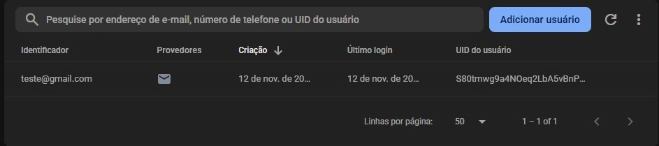

#### 🔄 Fluxo de Login:
- Validação dos campos de entrada
- Autenticação com **Firebase Auth**
- Redirecionamento para Content em caso de sucesso
- Feedback visual com mensagens de erro/sucesso
- Redirecionamento para RegisterScreen quando o usuário clicar no botão **Criar conta**

---

### RegisterScreen - Tela de Cadastro

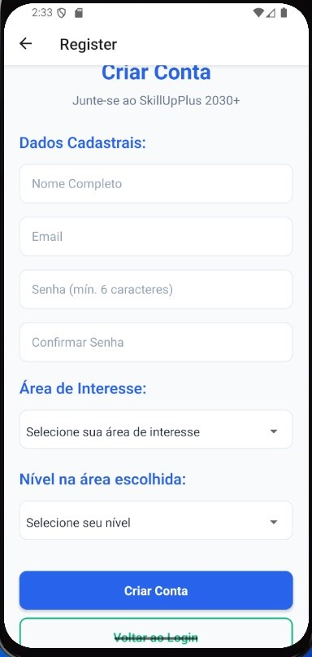

#### 📝 Formulário de Cadastro
O usuário preenche todos os campos obrigatórios para criar sua conta:
- **Nome Completo** - Identificação pessoal
- **Email** - Para login e comunicação
- **Senha** - Mínimo de 6 caracteres
- **Confirmar Senha** - Validação de segurança
- **Área de Interesse** - Definição do foco de aprendizado
- **Nível** - Autoavaliação de competências

#### 🎯 Área de Interesse
O usuário seleciona entre 6 áreas emergentes do mercado:


#### 📊 Nível de Conhecimento

Autoavaliação do usuário na área escolhida:


#### 🔄 Fluxo de Cadastro
1. **Preenchimento** dos dados pessoais e profissionais
2. **Validação** em tempo real dos campos
3. **Persistência** no Firebase Authentication (auth().createUserWithEmailAndPassword)
4. **Persistência** no Realtime Database (database().ref(`/users/${userId}`).set)
5. **Redirecionamento** para tela de Login após sucesso

```bash
await database().ref(`/users/${userId}`).set({
        nome,
        email,
        criadoEm: new Date().toISOString(),
        Courses: {
          Course1: {
            area: areaInteresse,
            nivel: nivelArea,
            cor: areaColors[areaInteresse] || '#666666',
            concluido: false,
          }
        }
      });
```

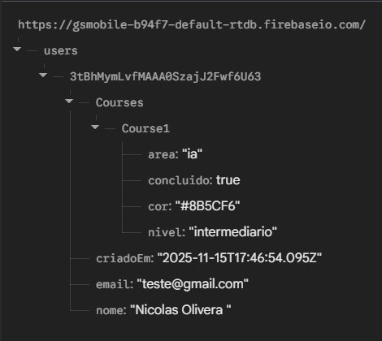

--- 

### CoursesScreen:

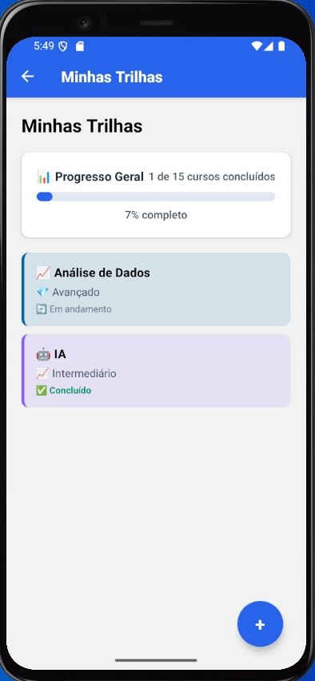

#### Barra de conclusão:

 - Barra de conclusão muda conforme o usuário vai concluindo cursos 
 - Usuário consegue **monitor o seu progresso**

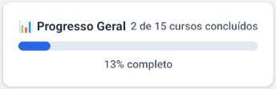

### CourseContentScreen:

## Alerts do projeto:

### Alerts de erro:


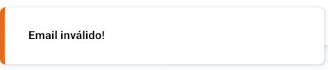

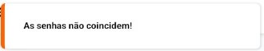

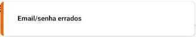

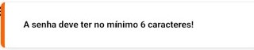

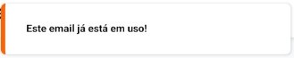

### Alerts que deram certo

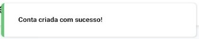

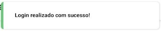

## Dependências instaladas 

### Firebase: 

```bash
npx create-expo-app SkillUpPlus --template blank-typescript
npx expo install expo-dev-client
npx expo install @react-native-firebase/app @react-native-firebase/auth @react-native-firebase/database  
npx expo install expo-build-properties
npx expo prebuild
```

### React Navigation

```bash
npx expo install @react-navigation/native
npx expo install react-native-screens react-native-safe-area-context
npx expo install @react-navigation/native-stack
```

### Integração com IA

```bash
npm install axios
npm install @google/generative-ai
```

### Toast

``` bash
npx expo install react-native-toast-message
```

### Picker

```bash
npx expo install @react-native-picker/picker
```